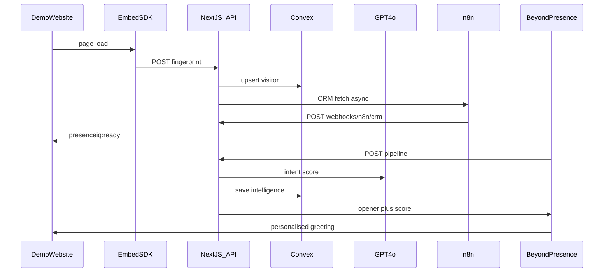

# PresenceIQ Architecture

PresenceIQ is a pre-conversation avatar that greets a website visitor with a
personalized opener inside a ~1.5 s budget. Tenants are isolated by `embedKey`;
each visitor is fingerprinted, scored against tenant-specific knowledge, and
optionally fanned out to downstream automation (Slack, CRM, n8n) on high
intent. The deep system walkthrough lives in
[SYSTEM_WORKFLOW.md](SYSTEM_WORKFLOW.md).

## Pre-conversation pipeline (< 2s)

## Component map

| Folder | Stack | Role |
| --- | --- | --- |
| [`frontend/`](../frontend) | Vite + React 19, Convex client, Clerk | SPA: landing, auth, canvas workspace, dashboards |
| [`backend/`](../backend) | Next.js 15 API routes + Convex functions | `/api/*` orchestration, Convex schema + queries/mutations |
| [`avatar/`](../avatar) | esbuild → IIFE `presenceiq-avatar.js` | Embeddable browser SDK that mounts the BeyondPresence iframe |
| [`devops/`](../devops) | Vercel deploy, n8n workflows, integration scripts | Deploy + CRM automation |

## External services

| Service | Used for | Code pointer |
| --- | --- | --- |
| Clerk | User identity (JWT → Convex auth) | [backend/convex/auth.config.ts](../backend/convex/auth.config.ts) |
| Convex | Realtime DB + serverless queries/mutations | [backend/convex/schema.ts](../backend/convex/schema.ts) |
| OpenAI (gpt-4o / 4o-mini) | Intent scoring + post-call analysis | [backend/src/lib/openai.ts](../backend/src/lib/openai.ts) |
| BeyondPresence | Managed video avatar (PATCH greeting, iframe) | [backend/src/lib/beyondPresenceApi.ts](../backend/src/lib/beyondPresenceApi.ts) |
| ElevenLabs | Voice selection for the avatar | [backend/src/lib/elevenlabs.ts](../backend/src/lib/elevenlabs.ts) |
| n8n | CRM-fetch + automation fan-out (Slack / CRM push) | [backend/src/lib/pipeline.ts](../backend/src/lib/pipeline.ts) |

## Data model (core tables)

- **businesses** — tenant config, `embedKey`, knowledge chunks, BP agent id
- **visitors** — fingerprint, `pageHistory`, `crmData`, return count
- **intelligence** — `intentScore`, `personalisedOpener`, signals
- **conversations** — post-call transcript, sentiment arc, outcome
- **triggers** — automation rules (intent threshold → webhook)
- **businessMembers** — Clerk user ↔ business role
- **usage** — credit accounting per billing period

Full shape in [backend/convex/schema.ts](../backend/convex/schema.ts).

## Read next

- **Every flow + algorithm, with pseudo-code** → [SYSTEM_WORKFLOW.md](SYSTEM_WORKFLOW.md)
- **Frontend deploy (Vercel SPA)** → [../devops/deploy/frontend-vercel.md](../devops/deploy/frontend-vercel.md)
- **Backend deploy** → [../devops/deploy/vercel.md](../devops/deploy/vercel.md)
- **Env vars** → [ENV.md](ENV.md)
- **API providers + keys** → [API_PROVIDERS.md](API_PROVIDERS.md)
