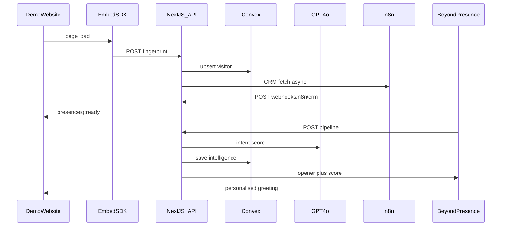

# PresenceIQ Architecture

## Pre-conversation pipeline (< 2s)

## Data model

- **businesses** — tenant config, embedKey, knowledge
- **visitors** — fingerprint, pageHistory, crmData
- **intelligence** — intentScore, personalisedOpener
- **conversations** — post-call transcript
- **triggers** — hot-lead Slack, CRM push rules

## Monorepo

| Folder | Stack |
|--------|-------|
| `backend/` | Next.js 15, Convex, OpenAI |
| `avatar/` | BeyondPresence, ElevenLabs |
| `frontend/` | Vite/React, Convex client |
| `devops/` | n8n workflows, deploy guides |
