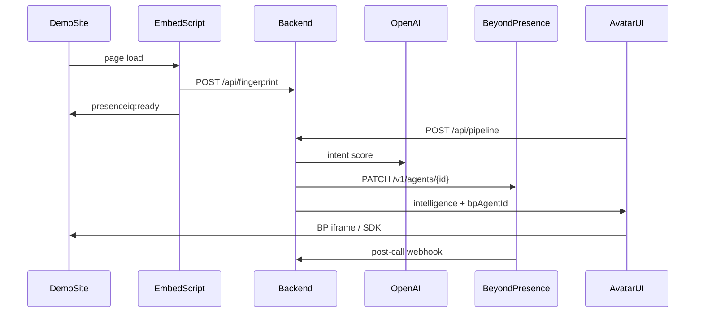

# Beyond Presence integration

PresenceIQ uses [Beyond Presence](https://beyondpresence.ai) for the live video avatar. The **API key lives only on the backend**; the avatar track calls backend routes instead of holding secrets.

Official docs: [docs.bey.dev](https://docs.bey.dev/get-started/api)

---

## What Beyond Presence does

- **Managed agents** — conversational video agents with system prompts and greetings
- **Avatars** — digital humans attached to agents
- **Calls** — live sessions with transcripts and evaluations
- **Webhooks** — real-time `message` and `call_ended` events ([webhook docs](https://docs.bey.dev/integrations/managed-agents/webhook-events))

PresenceIQ uses BP for the **live conversation** and OpenAI (backend) for **pre-call intent scoring**.

---

## Authentication

1. Open [Beyond Presence settings](https://app.bey.chat/settings) and create an API key.
2. Add to `backend/.env.local` (never commit):

```bash
BEYONDPRESENCE_API_KEY=sk-your-key-here
# optional:
# BEYONDPRESENCE_API_BASE_URL=https://api.bey.dev
```

3. All requests use header `x-api-key: <your-key>` against `https://api.bey.dev`.

If a key was ever pasted in chat or committed, **rotate it** in the dashboard immediately.

---

## PresenceIQ flow



| Step | Who | Action |
|------|-----|--------|
| 1 | Embed | `POST /api/fingerprint` — register visitor |
| 2 | Embed | Fire `presenceiq:ready` with `visitorId`, `businessId` |
| 3 | Avatar | `POST /api/pipeline` — CRM wait + GPT-4o intent |
| 4 | Backend | `PATCH /v1/agents/{bpAgentId}` — `system_prompt` + `greeting` |
| 5 | Avatar | Embed BP agent (iframe or SDK) using `bpAgentId` from response |
| 6 | BP / Avatar | `POST /api/webhooks/beyondpresence/session` — transcript + automation |

---

## Environment variables

| Variable | Where | Purpose |
|----------|-------|---------|
| `BEYONDPRESENCE_API_KEY` | `backend/.env.local` | Outbound BP API (verify, update agent) |
| `BP_WEBHOOK_SECRET` | backend + avatar | Validates post-call webhook (`X-BP-Webhook-Secret`) |
| `bpAgentId` | Convex `businesses.avatarConfig` | Which agent to update per tenant |

The avatar app should **not** set `BEYONDPRESENCE_API_KEY` when using the backend proxy pattern.

---

## Setup checklist

### 1. API key

```bash
cd backend
cp .env.example .env.local
# Edit BEYONDPRESENCE_API_KEY
npm run check:env
```

### 2. Verify connection

```bash
curl http://localhost:3000/api/beyondpresence/status
```

Expect `configured: true`, `verified: true`, and a list of agents (if any exist).

### 3. Create or pick an agent

In the [Beyond Presence dashboard](https://app.bey.chat):

1. Create a managed agent (or use an existing one).
2. Copy the **agent ID** from the agent settings or from `GET /api/beyondpresence/status`.

### 4. Link agent to Seylan demo business

```bash
cd backend
npx convex run seed:seedDemo '{"bpAgentId":"YOUR_AGENT_ID"}'
```

Or patch via Convex dashboard on the `seylan-demo` business `avatarConfig.bpAgentId`.

### 5. Test pipeline sync

After seeding a visitor (`npx convex run seed:seedDemo`), call pipeline with real IDs from fingerprint or Convex:

```bash
curl -X POST http://localhost:3000/api/pipeline \
  -H "Content-Type: application/json" \
  -d '{"visitorId":"<visitorId>","businessId":"<businessId>","waitForCrmMs":500}'
```

Response should include:

```json
{
  "success": true,
  "data": {
    "bpAgentId": "agent_...",
    "beyondPresence": { "synced": true }
  }
}
```

If `synced` is false, check `reason` (missing key, missing `bpAgentId`, or HTTP error).

### 6. Post-call webhook

Configure in BP dashboard → Settings → Webhooks:

- **URL**: `{NEXT_PUBLIC_APP_URL}/api/webhooks/beyondpresence/session`
- **Secret**: same value as `BP_WEBHOOK_SECRET` in backend (header `X-BP-Webhook-Secret`)

BP native `call_ended` payloads differ from PresenceIQ’s session body. Person 1 may translate BP events in the avatar layer, or use the existing custom POST from the embed integration. See [API contract](API_CONTRACT.md).

---

## Backend routes

| Method | Path | Description |
|--------|------|-------------|
| `GET` | `/api/beyondpresence/status` | Key configured + verified; lists agents |
| `POST` | `/api/pipeline` | Intent + auto-sync agent context |
| `POST` | `/api/webhooks/beyondpresence/session` | Post-call transcript + automation |
| `GET` | `/api/health` | Includes `checks.beyondPresence` |

Implementation: [`backend/src/lib/beyondPresenceApi.ts`](../backend/src/lib/beyondPresenceApi.ts)

---

## Avatar track (Person 1)

1. Listen for `presenceiq:ready`.
2. `POST {BACKEND_URL}/api/pipeline`.
3. Use `data.bpAgentId` to embed the agent (iframe / [managed agents](https://docs.bey.dev/integrations/managed-agents/iframe-embedding)).
4. On session end, POST to `/api/webhooks/beyondpresence/session` with the PresenceIQ payload shape.

Example: [`avatar/src/beyondpresence/integration.example.ts`](../avatar/src/beyondpresence/integration.example.ts)

---

## Further reading

- [Agents overview](https://docs.bey.dev/get-started/agents)
- [Update agent API](https://docs.bey.dev/api-reference/agents/update-agent)
- [Just-in-time context](https://docs.bey.dev/integrations/managed-agents/just-in-time-context)
- [Webhook events](https://docs.bey.dev/integrations/managed-agents/webhook-events)
- [All providers index](API_PROVIDERS.md)
