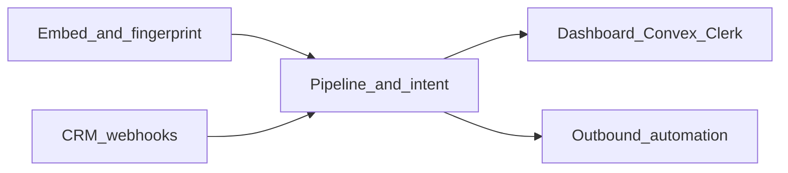

# PresenceIQ: Functional and non-functional requirements

Catalog of product requirements inferred from implemented surfaces, API contracts, and architecture docs.

**Sources:** [README.md](../README.md), [API_CONTRACT.md](API_CONTRACT.md), [ARCHITECTURE.md](ARCHITECTURE.md), [flashtech-hybrid skill](../.cursor/skills/flashtech-hybrid/SKILL.md), [backend/README.md](../backend/README.md), [health route](../backend/src/app/api/health/route.ts).

---

## Functional requirements (by capability)

### Visitor identity and embedding

| ID | Requirement |
|----|-------------|
| **FR-E1** | Host sites load an async embed script that boots the PresenceIQ client for a tenant-specific **`embedKey`** (e.g. `seylan-demo`). See [API_CONTRACT.md](API_CONTRACT.md) (Embed). |
| **FR-E2** | After fingerprinting, the embed raises a DOM event **`presenceiq:ready`** with `{ visitorId, businessId, sessionId }` so the avatar layer can proceed. |
| **FR-E3** | **`POST /api/fingerprint`** registers or updates a visitor from `{ embedKey, fingerprint, path, title, language, referrer }` and returns visitor/business linkage and CRM hints (`crmId`, return counts). |

### Pre-conversation intelligence pipeline

| ID | Requirement |
|----|-------------|
| **FR-P1** | **`POST /api/pipeline`** (called after ready) aggregates visitor context and returns intent intelligence, visitor, business, optional Beyond Presence sync metadata, **`bpAgentId`**, and **`pipelineMs`**. Partial success when BP is unset is allowed (`beyondPresence.synced: false` with reason). |
| **FR-P2** | **`POST /api/intent`** scores intent for `{ visitorId, businessId }` via GPT-4o when `OPENAI_API_KEY` is configured; otherwise a **demo fallback** applies for seeded scenarios. |
| **FR-P3** | Pipeline may **wait briefly for CRM enrichment** (`waitForCrmMs`), reflecting the asynchronous CRM path in [ARCHITECTURE.md](ARCHITECTURE.md). |

### CRM integration and ingestion

| ID | Requirement |
|----|-------------|
| **FR-C1** | **`POST /api/webhooks/crm-ingest`** (alias `POST /api/webhooks/n8n/crm`) accepts CRM payloads keyed by `visitorId` and updates `crmId` and structured `crmData`. Secured via **`X-Webhook-Secret`**. |
| **FR-C2** | **Seylan sandbox** probes: `GET|POST /api/seylan/account-inquiry` when `SEYLAN_API_*` env is set. |
| **FR-C3** | **Fake/demo CRM** data path exists when live automation is not configured. |

### Beyond Presence (avatar) orchestration

| ID | Requirement |
|----|-------------|
| **FR-B1** | Backend verifies Beyond Presence configuration via **`GET /api/beyondpresence/status`** (agent listing / verification). |
| **FR-B2** | **`POST /api/webhooks/beyondpresence/session`** ingests session outcomes (transcript, sentiment arc, duration, outcome) and drives downstream triggers (e.g. hot-lead when intent is high). |

### Automation and outbound actions

| ID | Requirement |
|----|-------------|
| **FR-A1** | Hot-lead and CRM-push behavior is wired **server-side** from pipeline/session paths when outbound webhook URLs and scoring thresholds are satisfied (`WEBHOOK_*`; legacy `N8N_*` still supported). |
| **FR-A2** | Operator tooling/scripts support validating outbound webhook URLs and integration smoke flows (`check:env`, `verify:all`, `validate:webhooks`, etc.). See [backend/README.md](../backend/README.md). |

### Tenant onboarding and configurability

| ID | Requirement |
|----|-------------|
| **FR-T1** | **`POST /api/businesses/onboard`** creates a tenant with **`industry`** in `{ bank, saas, hotel, hospital, ecommerce, hr }`, tone, language, **`embedKey`**, and returns embed snippet/URL for onboarding wizard. |

### Dashboard and Convex data access

| ID | Requirement |
|----|-------------|
| **FR-D1** | Authenticated dashboard users (Clerk) query Convex for **live sessions**, **session detail**, and **intelligence by business** subject to **`businessMembers`** linkage. |
| **FR-D2** | Public Convex query **`intelligence.getIntelligenceForAvatar`** serves avatar/embed paths without dashboard sign-in. |

### Hybrid product UI routing (FlashTech)

Per [flashtech-hybrid skill](../.cursor/skills/flashtech-hybrid/SKILL.md):

| ID | Requirement |
|----|-------------|
| **FR-H1** | Landing and primary login UX live on the **Vite** app; post sign-in flows may hand off to the **Next.js backend** `/dashboard`. |
| **FR-H2** | **`/demos/*`** routes expose tenant demo experiences with embed script conventions. |
| **FR-H3** | Signed-in operators use **`/canvas/*`** for workspace, sessions, analytics, profile, webhooks, embed snippet, categories, and industry dashboards. |

**Known gaps on `main`:** Vite login may be **mock**; Clerk-backed `/dashboard` may lag until `setup-clerk` merge — treat **FR-D1** as target where hybrid wiring is incomplete.

---

## Non-functional requirements

### Performance and latency

| ID | Requirement |
|----|-------------|
| **NFR-P1** | Pre-conversation pipeline target **under ~2s** ([ARCHITECTURE.md](ARCHITECTURE.md)); API responses expose **`pipelineMs`**. |
| **NFR-P2** | **`GET /api/health?probes=1`** marks **degraded** when Convex &gt;500ms or OpenAI/BP/ElevenLabs &gt;2000ms. |

### Security and tenancy

| ID | Requirement |
|----|-------------|
| **NFR-S1** | Inbound webhooks verify **shared secrets** (CRM ingest and BP webhook). |
| **NFR-S2** | **Clerk JWT** validation for Convex aligns dashboard queries with authenticated identity; **`businessMembers`** scopes business reads. |

### Availability, degradability, and partial operation

| ID | Requirement |
|----|-------------|
| **NFR-R1** | Core JSON APIs tolerate **missing optional integrations** (BP absent → HTTP 200 + `synced: false`; OpenAI absent → demo fallback). |
| **NFR-R2** | Health endpoint distinguishes **`ok`** vs **`degraded`** from required env completeness and optional live probes. |

### Operability (dev/prod hygiene)

| ID | Requirement |
|----|-------------|
| **NFR-O1** | Explicit env matrices per track (`backend/.env.example`, frontend/avatar parallels, [ENV.md](ENV.md)). |
| **NFR-O2** | Backend verification scripts: `check:env`, `verify:all`, webhook validation aliases. |

### Deployability / topology

| ID | Requirement |
|----|-------------|
| **NFR-D1** | **Split Vercel projects** for SPA frontend vs Next API backend with coordinated env (`VITE_BACKEND_URL`, Convex URL alignment). |
| **NFR-D2** | **CORS** on browser-facing API routes via shared helpers under `backend/src/lib/`. |

### Scalability and data architecture

| ID | Requirement |
|----|-------------|
| **NFR-X1** | Relational Convex model: **businesses, visitors, intelligence, conversations, triggers** — stateless API tier, durable data in Convex. |

---

## Traceability

| Area | Primary evidence |
|------|------------------|
| Embed + events | [API_CONTRACT.md](API_CONTRACT.md) |
| Performance target | [ARCHITECTURE.md](ARCHITECTURE.md), `pipelineMs` |
| AuthZ for dashboard | [API_CONTRACT.md](API_CONTRACT.md), [backend/README.md](../backend/README.md) |
| Degradation / probes | [backend/src/app/api/health/route.ts](../backend/src/app/api/health/route.ts) |
| Hybrid routing caveats | [flashtech-hybrid skill](../.cursor/skills/flashtech-hybrid/SKILL.md) |
