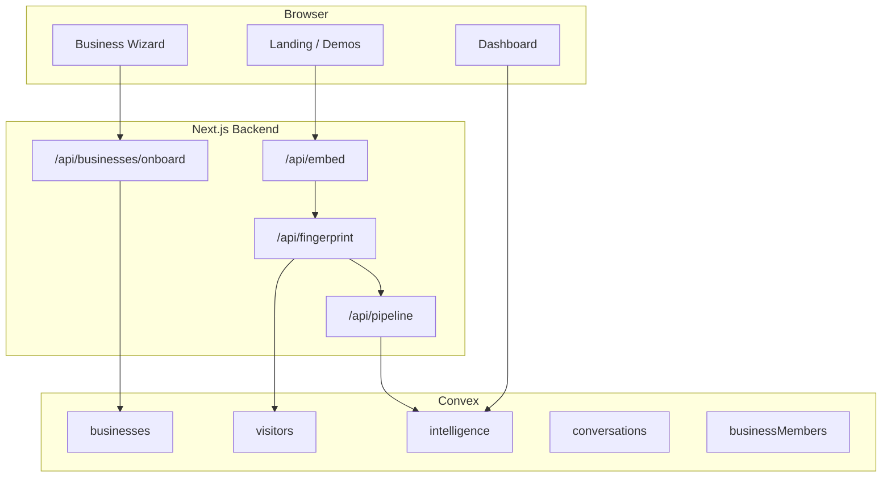

# PresenceIQ SaaS — Master roadmap

Phased plan to take the project from **demo-ready** to **production SaaS**.

## Current architecture



## Phase 1 — Critical workflow fixes (in progress)

| Item | Status | Notes |
|------|--------|-------|
| Dashboard reads `?embedKey=` | Done | After onboard, correct tenant loads |
| Demo queries allow any existing embed key | Done | Custom tenants work unsigned |
| Auth queries only with membership | Done | No more Forbidden when signed in |
| Onboard saves `bpAgentId` | Done | Passed to `createBusiness` |
| Search empty state in sessions table | Done | |
| Notifications prefer live feed | Done | Mock only when feed empty |
| Port/docs alignment | Partial | Use `3001` + `dev:3001` locally |

## Phase 2 — Onboarding & tenancy

- [ ] Link Clerk user on onboard (server token or post-signup redirect + `linkCurrentUser`)
- [ ] Auto `seedTriggers` on onboard when Slack webhook env set
- [ ] `updateBusiness` mutation (knowledge, webhooks, avatar config)
- [ ] Invite-only `linkCurrentUser` (first member admin, tokens for others)
- [ ] Settings page: embed snippet, BP agent ID, triggers

## Phase 3 — Dashboard product UI

- [ ] Real routes for Billing, Team, API Keys (or remove from nav)
- [ ] `sentimentArc` chart in Conversation Cinema
- [ ] Rename analytics chart “Intent by visitor” (not sentiment)
- [ ] Wire `listByBusiness` for KPI time series
- [ ] Pagination on live sessions (Convex cursor)
- [ ] Remove or merge dead dashboard components

## Phase 4 — Security & Convex hardening

- [ ] `returns` validators on all public functions
- [ ] `internalMutation` for server-only writes (`saveIntelligence`, `patchCrmData`, etc.)
- [ ] Protect `seedDemo` (deploy secret or internal only)
- [ ] Cross-table validation (`visitor.businessId === businessId`)
- [ ] Generated Convex API on frontend (shared package or codegen)

## Phase 5 — Homepage & marketing polish

- [x] Glass navbar + Clerk auth (landing hero)
- [x] Section animations + AnimatedCounter
- [ ] Consistent `Layout` header with Sign in / Sign up
- [ ] Industries / pricing content refresh
- [ ] Case-study or demo video sections

## Phase 6 — Integrations & ops

- [ ] n8n workflows documented and env-verified per tenant
- [ ] Health dashboard in admin
- [ ] E2E test: embed → fingerprint → pipeline → dashboard row
- [ ] Vercel env sync script in CI

## Local dev checklist

```bash
# Terminal 1 — backend on 3001
cd backend && npm run dev:3001

# Terminal 2 — frontend
cd frontend && npm run dev

# Terminal 3 — Convex
cd backend && npx convex dev
```

Env: `VITE_BACKEND_URL=http://localhost:3001`, `NEXT_PUBLIC_APP_URL=http://localhost:3001`, matching `VITE_CONVEX_URL` / `NEXT_PUBLIC_CONVEX_URL`, optional Clerk keys.

## Priority bugs addressed in code

1. **Onboard → dashboard** embed key ignored  
2. **Custom tenant** dashboard demo mode threw Invalid demo embedKey  
3. **Signed-in, no membership** triggered Forbidden on `listLiveSessions`  
4. **BP agent ID** not persisted from wizard  

See git history and `docs/ENV.md` for environment details.
