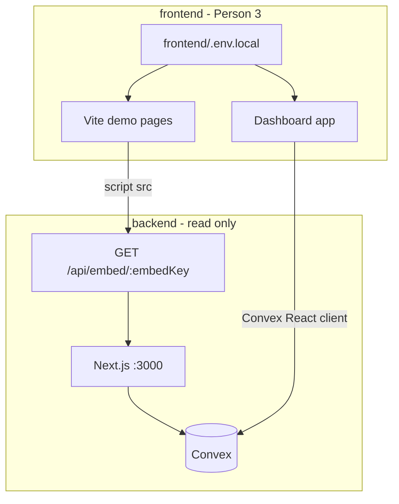

# Frontend development guide (Person 3)

**Department boundary:** You own everything under `frontend/`. Analyze [`backend/`](../backend/), [`avatar/`](../avatar/), and [`devops/`](../devops/) read-only — do not edit or implement there.

**Start here:** [README.md](./README.md) · Checklist: [DEVELOPMENT_PLAN.md](./DEVELOPMENT_PLAN.md)

---

## A. Your responsibilities

| Deliverable | Description |
|-------------|-------------|
| Demo sites | Three branded pages with embed SDK: Seylan Bank, CloudMetrics SaaS, Coral Resort |
| Live dashboard | Real-time operator UI via Convex (`listLiveSessions`, `getSessionDetail`) |
| Embed integration | Load backend embed script; verify `presenceiq:ready` fires |
| Demo leadership | Second screen for pitch; demo script steps 1–2 and 5–6 ([team plan](../docs/DEVELOPMENT_PLAN.md) — link only) |
| Frontend deploy | Co-own hosting (Vercel or Netlify); record live URLs in [README.md](./README.md) |

You do **not** build REST APIs, Convex schema, OpenAI, n8n, or BeyondPresence webhooks.

---

## B. Environment and cloud URLs

Copy [`frontend/.env.example`](./.env.example) → `frontend/.env.local`.

| Variable | Purpose | Local example |
|----------|---------|---------------|
| `VITE_BACKEND_URL` | Embed `<script src>` host + any REST calls | `http://localhost:3000` |
| `VITE_CONVEX_URL` | Convex React client (must match backend) | Same as backend `NEXT_PUBLIC_CONVEX_URL` |

Shared env rules: [`docs/ENV.md`](../docs/ENV.md) (read-only).

### Who provides what

| Item | Owner | You use it for |
|------|-------|----------------|
| Convex deployment URL | Person 2 | `VITE_CONVEX_URL` |
| Production backend URL | Person 2 (after Vercel) | Embed `src` in prod demo pages |
| Query names & shapes | Person 2 | [`docs/API_CONTRACT.md`](../docs/API_CONTRACT.md) |
| Frontend dashboard URL | **You** | Team “Shared URLs” + README live table |
| Demo site URLs | **You** | Three hosted or local demo routes |

Convex deploy (Person 2): see [`devops/deploy/convex.md`](../devops/deploy/convex.md). Frontend deploy: see [`devops/DEVELOPMENT_PLAN.md`](../devops/DEVELOPMENT_PLAN.md) — you set `VITE_*` in the frontend project on Vercel/Netlify.

---

## C. Convex and the landing page

- **`/`** — marketing landing; **no** Convex client (no WebSocket errors in console).
- **`/dashboard`** — wrapped in `ConvexAppProvider`; requires valid `VITE_CONVEX_URL` in `.env.local`.

If the dashboard shows “Convex not configured”, copy `.env.example` → `.env.local` and match Person 2’s Convex URL.

---

## D. Local workflow



1. **Person 2** runs backend: `cd backend && npm run dev` and `npm run convex:dev` (and `npm run seed` once).
2. **You** run frontend: `cd frontend && npm install && npm run dev`.
3. Open a demo route → confirm embed loads → open dashboard → reload demo → session row updates without refresh.

Default ports: backend `3000`, Vite `5173` (unless configured otherwise).

---

## D. Embed integration

Script pattern (use env in React; static HTML can use localhost for local dev):

```html
<script src="{VITE_BACKEND_URL}/api/embed/{embedKey}" async></script>
```

| Demo site | embedKey |
|-----------|----------|
| Seylan Bank | `seylan-demo` |
| CloudMetrics SaaS | `cloudmetrics-demo` |
| Coral Resort | `coral-demo` |

**Behavior** (from [`backend/src/app/api/embed/[embedKey]/route.ts`](../backend/src/app/api/embed/[embedKey]/route.ts)):

1. Page load → SDK POSTs `/api/fingerprint` with fingerprint + page metadata.
2. On success → `window.dispatchEvent(new CustomEvent("presenceiq:ready", { detail: { visitorId, businessId, sessionId, returnCount, isKnownVisitor } }))`.

Person 1’s avatar listens for `presenceiq:ready` on the demo page. Your job is to include the script and confirm the event in devtools.

**React helper:** use `EmbedScript` in `src/components/EmbedScript.tsx` with `import.meta.env.VITE_BACKEND_URL`.

---

## E. Dashboard (Convex)

Contract: [`docs/API_CONTRACT.md`](../docs/API_CONTRACT.md) (Convex section).

| Query | Args | Use |
|-------|------|-----|
| `intelligence.listLiveSessions` | `{ businessId }` | Live session table |
| `intelligence.getSessionDetail` | `{ visitorId }` | Detail panel |
| `businesses.getByEmbedKey` | `{ embedKey }` | Resolve `businessId` for filters |

Return shapes are implemented in [`backend/convex/intelligence.ts`](../backend/convex/intelligence.ts) and [`backend/convex/businesses.ts`](../backend/convex/businesses.ts).

### Convex client in this monorepo

Generated Convex code lives in **`backend/convex/_generated/`** (owned by Person 2). Do **not** import `api.js` from there in the Vite app — it pulls in `convex/server` and breaks the client build.

Use the frontend shim at [`src/convex/api.ts`](./src/convex/api.ts) (query path strings must match backend). For document IDs, use [`src/convex/ids.ts`](./src/convex/ids.ts) (do not add `backend/convex/_generated` to `tsconfig.json` — it type-checks server Convex files and breaks CI):

```ts
import type { Id } from "@/convex/ids";
import { api } from "@/convex/api";
import { ConvexProvider, ConvexReactClient } from "convex/react";

const client = new ConvexReactClient(import.meta.env.VITE_CONVEX_URL);

// useQuery(api.intelligence.listLiveSessions, { businessId })
// useQuery(api.businesses.getByEmbedKey, { embedKey: "seylan-demo" })
```

When Person 2 adds new queries, add matching entries to `src/convex/api.ts`. Keep `VITE_CONVEX_URL` in sync with their deployment.

---

## F. Static assets

| File | Purpose |
|------|---------|
| [`public/fake-crm.json`](./public/fake-crm.json) | Demo CRM record `CRM-001` (Sarangan); matches backend seed and n8n lookup shape |

The embed SDK does not fetch this file; n8n/backend use it in the pipeline. Keep it for demo narrative consistency.

---

## G. E2E verification checklist

1. [ ] Seylan demo: pricing section visible; embed script present.
2. [ ] First visit: `presenceiq:ready` in console with `visitorId`, `businessId`, `sessionId`.
3. [ ] Reload same browser: `returnCount` increases; dashboard shows visitor **without** manual refresh.
4. [ ] After P1+P2 avatar pipeline: dashboard shows `intentScore` / personalised opener for seeded Sarangan path.
5. [ ] Smoke-test CloudMetrics and Coral embed keys.
6. [ ] Second-screen layout ready (dashboard visible for demo step 5 while P2 shows Slack on step 4).

---

## H. Routes (this app)

| Path | Page |
|------|------|
| `/` | Home — links to dashboard and demos |
| `/dashboard` | Live sessions + detail |
| `/demos/seylan` | Seylan Bank |
| `/demos/cloudmetrics` | CloudMetrics SaaS |
| `/demos/coral` | Coral Resort |

---

## I. What not to build

- `backend/src/app/api/*` routes, Convex schema/mutations, OpenAI calls
- `avatar/` BeyondPresence integration
- `devops/n8n/*` workflows
- Edits to shared `docs/*` (request changes via Person 2 / team lead)

---

## J. Troubleshooting

| Symptom | Check |
|---------|--------|
| Embed 404 | Backend running? `VITE_BACKEND_URL` correct? |
| `presenceiq:ready` never fires | Network tab on `/api/fingerprint`; CORS/backend errors |
| Dashboard empty | `VITE_CONVEX_URL` matches backend; seed run (`npm run seed` in backend) |
| Types broken on Convex API | Person 2 ran `convex dev`; `_generated` exists under `backend/convex/` |
| Wrong tenant data | `businessId` from `getByEmbedKey` matches demo embed key |
